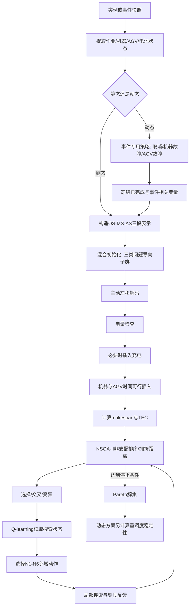
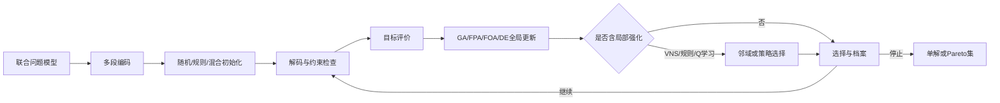
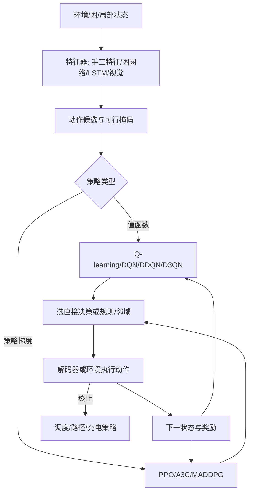
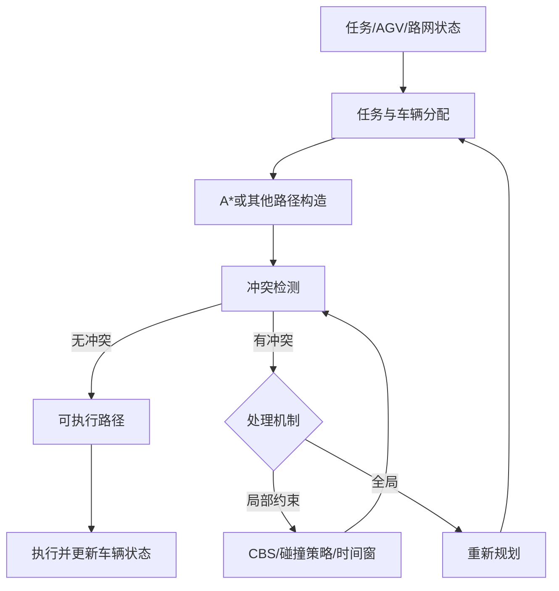
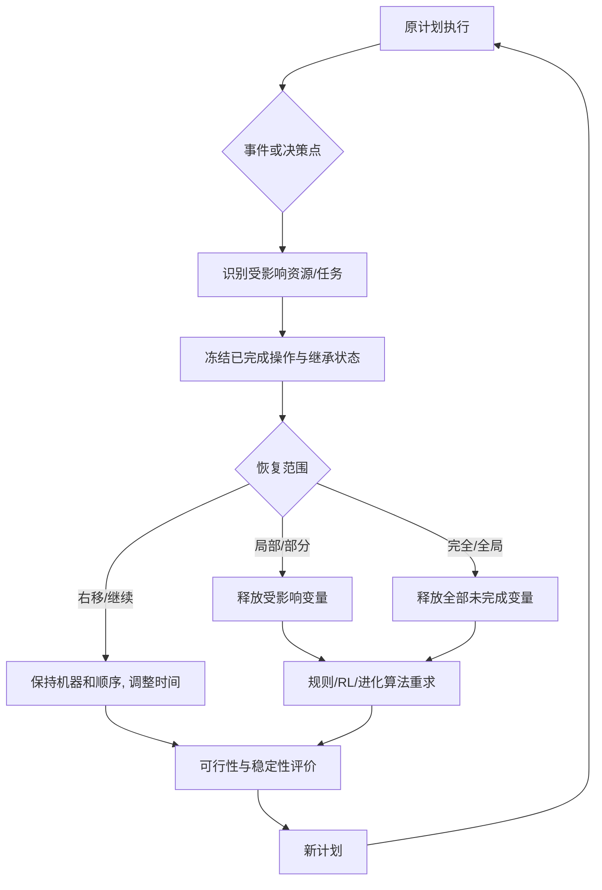

# N5 方法流程图

## 1. 图例

- 实线箭头：主数据流。
- 虚线语义（文字标注“反馈”）：评价或事件返回上游。
- `待核`：现有转换文本不足，不补造调用细节。

## 2. B001 QNSGA-II 完整调用链

### 职责核对

| 模块 | 负责 | 不负责 |
|---|---|---|
| 事件策略 | 决定保留/释放哪些变量 | 不执行多目标搜索 |
| 三段编码 | 表示工序、机器、AGV选择 | 不生成具体开始时间 |
| 解码器 | 充电、运输和加工时序可行化 | 不选择最优邻域 |
| NSGA-II | 全局多目标演化与精英保留 | 不自动理解事件语义 |
| Q-learning | 根据反馈选择邻域 N1–N6 | 不直接替代染色体或解码器 |

**失效边界：**并发事件、错误状态继承、未建模路径冲突或充电参数偏差会使该调用链需要扩展，而不是仅调节NSGA-II参数。

## 3. 联合进化优化通用链

代表文献：B002、B005、B011、B018、B019、B022、B028。

- **直接决策机制：**编码、解码和可行化决定调度变量如何落地。
- **搜索效率机制：**自适应参数、PCA、种群合并、Q-learning选邻域等只改变搜索路径，不能单独视为问题创新。
- **失效边界：**编码未覆盖动态状态、路径或电池时，强化搜索并不能修复模型缺失。

## 4. 强化学习调度通用链

代表文献：B003、B004、B010、B012–B017、B020、B023、B027。

### 三种不同职责

1. **直接决策：**B004、B010、B012–B017、B020、B023直接输出调度、路径或充电动作。
2. **规则选择：**B027让D3QN选择复合派工规则，实际工序/机器动作由规则执行。
3. **搜索控制：**B001、B005的Q-learning选择邻域或搜索策略，主求解器仍是进化算法。

**失效边界：**训练分布偏移、不可观测状态、动作可行掩码遗漏、奖励错配或仿真—现实差距会导致策略失效。

## 5. 任务分配—路径规划混合链

代表文献：B007、B021、B024、B025。

- B007、B025更接近顺序/分层链；上游任务分配会限制下游路径空间。
- B021采用A*、DQN、CBS分层协作。
- B024在冲突时允许全局重规划，形成路径向任务层的反馈。
- **失效边界：**高密度冲突、频繁在线任务或通信延迟可能引发组合爆炸和过时计划。

## 6. 动态恢复通用链

代表文献：B001、B016、B027、B028、B029。

| 文献 | 事件入口 | 恢复范围控制 | 核心求解器 |
|---|---|---|---|
| B001 | 订单取消、机器/AGV故障 | 三类事件专用冻结与释放 | QNSGA-II |
| B016 | 新到达、工时不确定 | 右移与完全重调度组合选择 | 联合调度器＋时间窗路径器 |
| B027 | 完成点或新扰动 | 每个重调度点选择复合规则 | MachineRank＋D3QN |
| B028 | 机器/机器人故障、插单、充电维护 | 每次事件后全局连续重调度 | GA＋VNS |
| B029 | 机器故障 | 右移或完全重调度 | GA |

**共同缺口：**现有材料没有明确证明同一时段并发事件的联合状态继承与冲突解决。

## 7. 输出接口

| 输出 | 后续消费者 |
|---|---|
| 调度/路径/策略 | N6记录算例、指标和预算 |
| Pareto解集 | N6核验HV、IGD、C-metric等定义 |
| 恢复方案 | N6记录稳定性与动态协议；N7比较适用条件 |
| 机制失效条件 | N7局限评价；N8候选创新路线和失败出口 |
